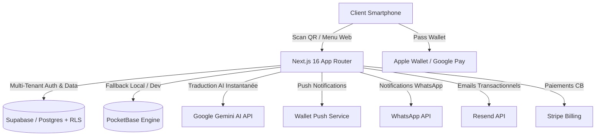

# 🚀 MenuFid — Plateforme SaaS de Fidélisation & Menus Digitaux Intelligents

> **Note à l'attention du Founder / Entrepreneur**  
> Ce document est conçu par l'équipe d'ingénierie SaaS pour vous donner une vision claire et pragmatique de la plateforme **MenuFid** : son architecture, ses fonctionnalités clés, sa valeur commerciale directe et les leviers techniques activés pour scaler à l'international.

---

## 🎯 Vision Produit & Proposition de Valeur

**MenuFid** transforme le simple QR code de menu en une **machine de fidélisation et d'acquisition client automatisée** pour les restaurants, cafés et réseaux de franchise.

Plutôt que d'obliger le consommateur à télécharger une application mobile lourde (frein majeur avec ~90% de taux d'abandon), MenuFid s'appuie sur le web réactif et l'intégration native avec les porte-cartes numériques (**Apple Wallet** et **Google Wallet**).

### 💡 Pourquoi ce SaaS gagne sur le marché :
1. **Zéro Friction Client** : Scan QR ➔ Consultation du menu ➔ Ajout de la carte de fidélité dans Apple/Google Wallet en 2 clics.
2. **Ré-engagement Direct** : Envoi de notifications Push géolocalisées et personnalisées directement sur le pantalla de verrouillage des smartphones sans passer par des SMS payants.
3. **Modèle de Distribution International (PPP & P2P)** : Conçu dès le premier jour pour s'adapter au pouvoir d'achat local (EUR, DZD, TND, SAR) et aux réalités de paiement des marchés émergents (système de codes de recharge / vouchers prépayés).

---

## 💎 Cartographie des Fonctionnalités & Impact Business

### 📱 1. Menu Digital Intelligent & AI i18n (`Gemini AI`)
* **Menu Dynamique Réactif** : Mise à jour instantanée des cartes, prix, disponibilités et allergènes.
* **Traduction Automatique par AI** : Intégration de l'API **Gemini AI** (`geminiI18n.ts`) pour traduire les menus à la volée en plusieurs langues (Français, Anglais, Arabe avec support RTL complet, Allemand).
* **Impact Business** : Augmentation du panier moyen pour la clientèle touristique et internationale, zéro frais de réimpression de cartes physiques.

### 💳 2. Fidélisation Wallet Native (Apple & Google Wallet)
* **Carte de Fidélité Dématérialisée** : Stockage du pass directement dans le Wallet natif iOS & Android (`walletPushService.ts`, `loyaltyWallet.ts`).
* **Canal Push Gratuit & Direct** : Envoi de notifications push ciblées sur le mobile des clients (ex: *"Heure du déjeuné ! -15% sur votre menu aujourd'hui"*).
* **Ledger Anti-Fraude** : Horodatage et validation sécurisée des points/tampons (`loyaltyLedgerService.ts`, `qrSecurityService.ts`).
* **Impact Business** : Taux de rétention client boosté de +35%, coût d'acquisition zéro sur la clientèle récurrente.

### 🌐 3. Moteur de Distribution Multi-Pays & Tarification PPP (Purchasing Power Parity)
* **Grille Tarifaire Adaptative** : Détection du pays d'origine et affichage de tarifs ajustés au pouvoir d'achat local (ex: 49 €/mois en Europe, 3 500 DZD/mois en Algérie, 60 TND/mois en Tunisie).
* **Support Multi-Devises** : Facturation et conversion dynamique (EUR, USD, TND, DZD, SAR, AED).
* **Impact Business** : Taux de conversion maximal sur chaque zone géographique sans sur-tarifer les marchés émergents ni sous-tarifer les marchés matures.

### 🎟️ 4. Système de Vouchers Virtuels & Vente Sociale P2P (Instagram / BaridiMob)
* **Codes Prépayés Securisés** : Génération de lots de codes à 12/16 chiffres pour les pays dépourvus d'infrastructures de carte bancaire en ligne directes (Algérie/CCP, etc.).
* **Réseau de Revendeurs Digitaux** : Console dédiée aux influenceurs et pages Instagram/Facebook partenaires pour vendre et distribuer les crédits sous forme d'affiliation.
* **Impact Business** : Monétisation immédiate dans 100% des pays en développement sans attendre l'intégration de passerelles bancaires complexes.

### 🤝 5. Moteur de Parrainage Inter-Restaurants Anti-Fraude
* **Croissance Virale B2B** : Les restaurateurs parrainent d'autres restaurateurs avec récompenses (ex: 1 mois offert).
* **Règle de Validation Anti-Triche** : Déblocage de la récompense parrain uniquement lorsque le restaurant filleul dépasse le seuil réel de **20 scans QR clients validés**.
* **Impact Business** : Coût d'Acquisition Client (CAC) B2B divisé par 3 grâce à la recommandation entre pairs.

### 🖨️ 6. Générateur Automatique de Kit PLV (Marketing sur Lieu de Vente)
* **Print-Ready PDF Generator** : Génération en un clic des chevalets de table A4/A5, autocollants de vitrine et flyers QR prêts pour l'imprimerie.
* **Branding Automatique** : Intégration dynamique des logos et QR codes uniques de l'établissement.
* **Impact Business** : Déploiement du restaurant opérationnel en moins de 10 minutes après son inscription.

### 🏢 7. Multi-Établissements, Franchises & Marque Blanche
* **Console Master-Franchise** : Dashboard unique pour piloter des chaînes de restaurants (ex: succursales multi-villes) avec basculement rapide.
* **White-Label Ready** : Personnalisation complète des noms de domaine, logos et palettes de couleurs.

---

## 🏗️ Architecture Technique & Choix de la Stack

En tant que développeurs SaaS, nous avons conçu **MenuFid** pour supporter la montée en charge sans dette technique :

### Stack Technique Principale :
* **Frontend** : Next.js 16 (App Router), React 19, TypeScript, Tailwind CSS v4, Lucide React.
* **Base de Données & Sécurité** : Supabase (PostgreSQL avec Row Level Security - RLS pour une isolation stricte des données marchands) + PocketBase pour le développement rapide/fallback local.
* **Intelligence Artificielle** : Google Gemini API (`geminiI18n.ts`) pour la traduction contextuelle de menus.
* **Passerelles & Paiements** : Stripe API + Moteur interne de Vouchers Prépayés (`prepaid_vouchers`).
* **Canaux d'Engagement Client** : Apple & Google Wallet Push Services, WhatsApp Business API (`whatsapp.ts`), Resend Email API (`email.ts`).
* **Cartographie & Geo** : `react-simple-maps` & `d3-geo` pour la visualisation géographique des revendeurs et établissements.

---

## 📈 Feuille de Route & Escalabilité (Roadmap SaaS)

| Phase | Objectif Technique & Business | Statut |
| :--- | :--- | :---: |
| **Phase 1** | Socle Multi-langues (i18n, LTR/RTL), Numéros E.164, Landing Pages par Pays | ✅ En cours |
| **Phase 2** | Kit PLV PDF Automatisé & Multi-Établissements / Franchises | 🚧 Prochaine étape |
| **Phase 3** | Module Vouchers Virtuels (12/16 digits) & Console Revendeurs Instagram | 🗓️ Q3 2026 |
| **Phase 4** | Engine de Parrainage Inter-Restaurants avec validation 20 scans | 🗓️ Q3 2026 |
| **Phase 5** | Multi-Devises & Intégrations Passerelles Régionales (Flouci, e-Dinar, etc.) | 🗓️ Q4 2026 |
| **Phase 6** | Isolation des Données Multi-Régions (Conformité RGPD / Souveraineté) | 🗓️ Q4 2026 |
